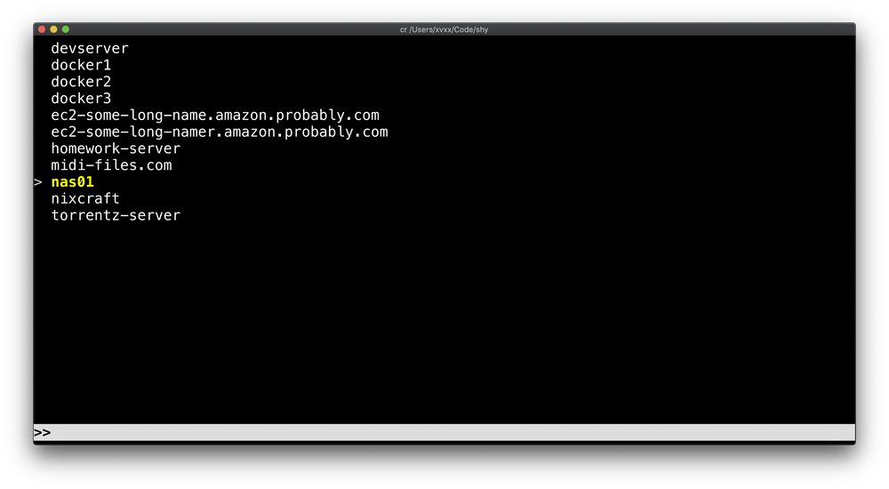

# shy

`shy` is a lil console ui for quickly connecting to an ssh server. It
parses your `~/.ssh/config` file and displays all your "Host" patterns,
allowing you to quickly select one using a readline-ish prompt.

## install

If you have [cargo] installed, installation is a breeze:

    cargo install shy

Assuming you have `~/.cargo/bin` in your `$PATH` and a `~/.ssh/config`
file, you can now run:

    shy

To connect more quickly to a host, you may want to launch in search
mode:

    shy -s

## keyboard shortcuts

| **Shortcut**        | **Nav Mode**        | **Search Mode**                    |
| ------------------- | ------------------- | ---------------------------------- |
| `i`, `s`, `f`, `/`  | Enter search mode   |                                    |
| `up`, `ctrl-p`      | Move selection up   | Jump to previous match             |
| `down`, `ctrl-n`    | Move selection down | Jump to next match                 |
| `PageDown`, `space` | Jump down 5 entries |                                    |
| `PageUp`, `-`       | Jump up 5 entries   |                                    |
| `r`, `F5`           | Refresh             |                                    |
| `ctrl-c`, `ESC`     | Quit                | Clear Input, then Exit Search Mode |

## screenies

|  |  |
| --------------------------------- | --------------------------------- |
|  |  |

## TODO

- [ ] screencast for README

[cargo]: https://rustup.rs/
